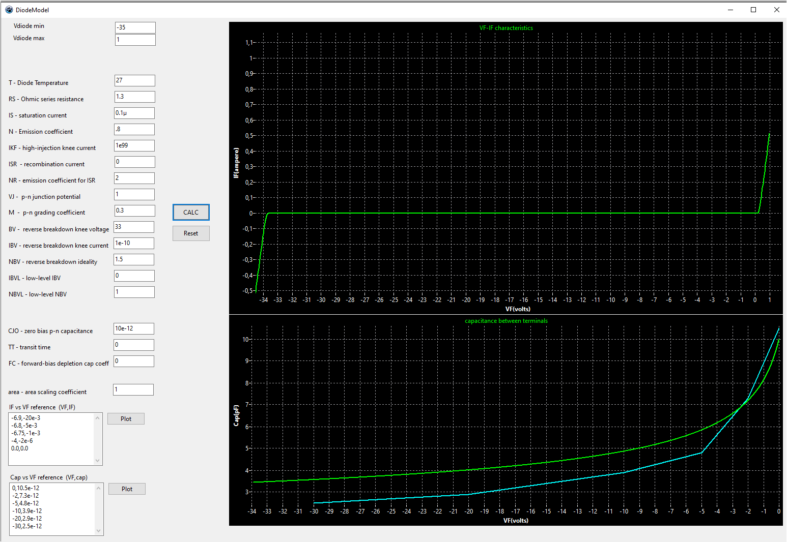

# SpiceModelGen

This repo serves as documentation for my Spice model Generator while developing it..
See this repos wiki page.

https://github.com/wirbel-at-vdr-portal/SpiceModelGen/wiki

The first task will be modelling Diodes as per extended Berkeley spice model, described in the PSpice reference manual.
Other devices and the binary may or may not show up here, depending on my needs.

